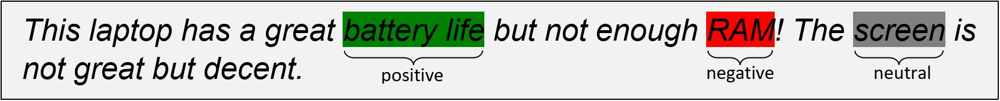
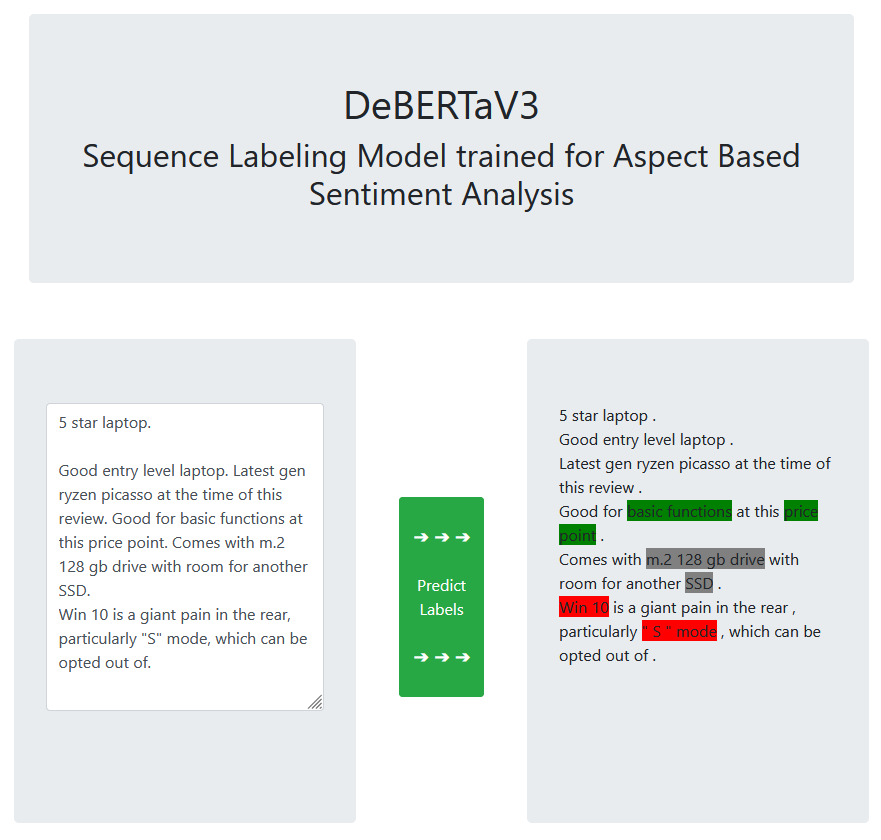
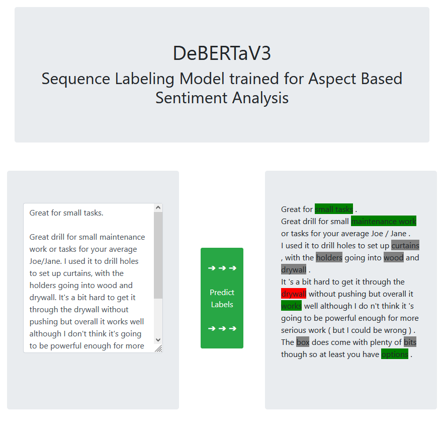
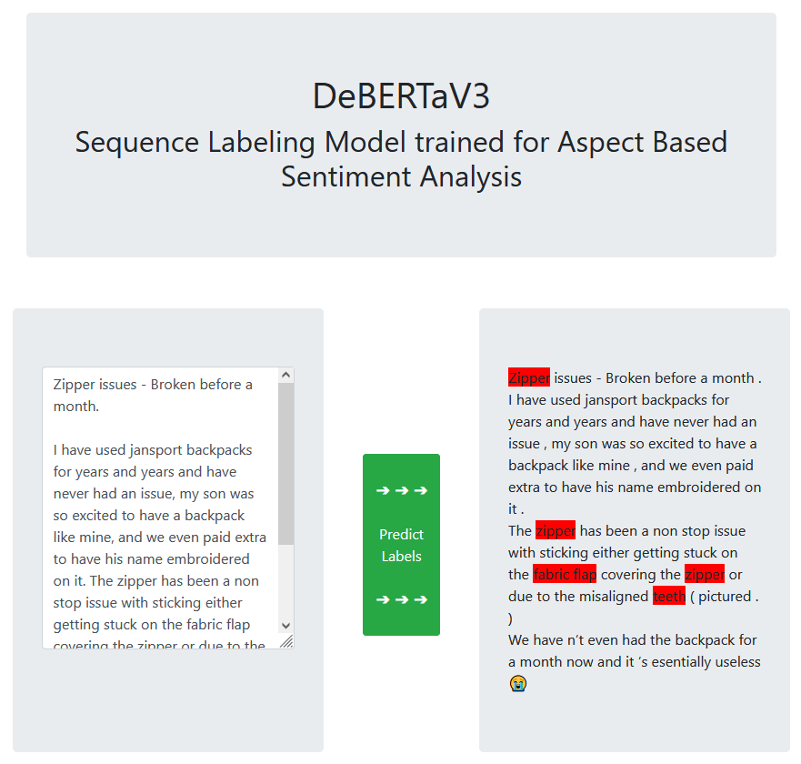

## DeBERTaV3 for Aspect Based Sentiment Analysis

Application for training the pretrained transformer model DeBERTaV3 (see paper [DeBERTaV3: Improving DeBERTa
using ELECTRA-Style Pre-Training with Gradient-Disentangled Embedding Sharing](https://arxiv.org/abs/2111.09543)) on an *Aspect Based Sentiment Analysis* task.

Aspect Based Sentiment Analysis is a Sequence Labeling task where product reviews are labeled with their
*aspects* as well as the detected *sentiments* towards each of these aspects.
Aspects in the context of product reviews are N-Grams explicitly mentioning specific functionalities, parts and related 
services around the product, with the part of speech being limited to nouns, noun phrases or verbs.

| <kbd></kbd>     |
|:-----------------------------------------:|
| *Example of an annotated product review*  |

Training data source for the model were 1.570 sampled product reviews (5.872 sentences) from the [Amazon Review Dataset](https://nijianmo.github.io/amazon/index.html) - 
specifically from the five product categories `Laptops`, `Cell Phones`, `Mens Running Shoes`, `Vacuums`, `Plush Figures` - 
which I manually annotated for my bachelor's thesis following a modified version of the [SemEval2014 Aspect Based Sentiment Analysis guidelines](http://alt.qcri.org/semeval2014/task4/data/uploads/semeval14_absa_annotationguidelines.pdf) and the annotation tool [Universal Data Tool](https://udt.dev).

The model was trained for 10 epochs on the combined dataset from all five categories (training time: 02h:05m:03s on NVIDIA GeForce GTX 1660 Ti).
Model training, evaluation and inference is implemented using the wrapper [simpletransformers](https://simpletransformers.ai/) which uses [huggingface](https://huggingface.co/).
Since it requires word tokenized and sentence tokenized inputs, the raw text is first pre-processed using [SpaCy](https://spacy.io/).

The frontend and routing is implemented in [Flask](https://flask.palletsprojects.com), using [Jinja](https://jinja.palletsprojects.com) as Template Engine for rendering the HTML and [Bootstrap](https://getbootstrap.com/) for the frontend design.

 

### Model Evaluation on Test Set

|               Metric              |  microsoft/deberta-v3-base  |
|:---------------------------------:|:---------------------------:|
|            Precision              | 0.659                       |
|            Recall                 | 0.691                       |
|            Micro F1-Score         | 0.675                       |

 

### Examples of product reviews labeled by the model

##### Trained category (Laptops), 5 stars:

<kbd></kbd>

 

##### Non-trained category (Power Drills), 4 stars:

<kbd></kbd>

 

##### Non-trained category (Backpacks), 1 star:

<kbd></kbd>

 

### Requirements

##### - Python >= 3.8

##### - Conda
  - `pytorch==1.7.1`
  - `cudatoolkit=10.1`

##### - pip
  - `simpletransformers`
  - `spacy`
  - `pandas`
  - `openpyxl`
  - `tqdm`
  - `flask`

##### - SpaCy models
  - `en_core_web_lg`

 

### Notes

The uploaded versions of the training data in this repository are cut off after the first 1000 rows of each file, the 
real training data contains a combined ~90.000 rows. The trained model file `pytorch_model.bin` is omitted in this repository.
